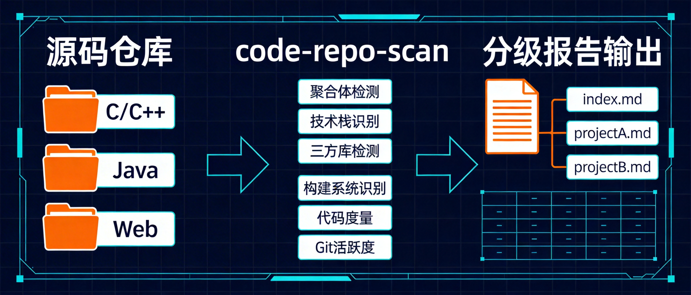

# repo-scan

[](https://www.python.org/)
[](LICENSE)
[]()
[]()

**English** | [中文](README_zh.md)

> An Agent Skill for architecture-level, cross-tech-stack source code asset scanning and analysis.
>
> Every ecosystem has its own dependency manager, but **no tool looks across all stacks and tells you: how much code is actually yours.** Know what you have before you refactor.
>
> Generates interactive local HTML reports — no internet required. Monorepo support with hierarchical scanning: click a card on the summary page to drill into sub-project details.



---

## Who Needs It

- **Large projects / Monorepo teams** — Years of accumulated modules, need a quick global asset inventory
- **Cross-platform teams** — Electron, React Native, Flutter or custom cross-platform — multiple tech stacks, no unified view
- **Architects / Tech leads** — Need a data-driven asset ledger before refactoring, merging, or commercialization decisions
- **Native developers (C/C++, iOS, Android)** — Third-party libs scattered in source dirs, no unified dependency tracking
- **Anyone inheriting legacy code** — Step one is "what's here", not "what to change"

---

## What It Does

**repo-scan** performs a complete asset inventory of your codebase. Python 3, zero dependencies, one command.

### Core Features

- **Three-way classification** — Automatically categorizes files into **project code** / **third-party dependencies** / **build artifacts** with accurate size metrics
- **Third-party detection & versioning** — Auto-identifies 50+ known libraries (FFmpeg, Boost, OpenSSL, etc.) and extracts version info from VERSION files, header `#define`s, `package.json`, `CMakeLists.txt`, etc.
- **Four tech stacks** — C/C++, Java/Android, iOS (OC/Swift), Web (TS/JS/Vue) — all covered
- **Code duplication detection** — Finds duplicate directory names across the project, auto-excludes third-party false positives
- **Git activity analysis** — Auto-discovers all sub-repositories with commit history and activity levels
- **Hierarchical report output** — Large monorepos auto-split into `index.html` + sub-project reports, keeping AI context manageable
- **Cross-module review** — After all sub-projects are analyzed, a second pass identifies capability overlaps, dependency topology, verdict corrections, and refactoring priorities
- **Interactive HTML reports** — Auto-generated dark-theme local pages; hierarchical mode creates `index.html` with clickable cards linking to sub-project details
- **Three analysis depth levels** — `fast` / `standard` / `deep` to balance speed vs. thoroughness
- **Incremental deep analysis** — `deep` mode works on top of existing `standard` data, selectively analyzing high-value modules with thread safety, memory management, error handling, and API consistency checks
- **AI token efficiency** — "Filename inference → key file reading → quality sampling" three-layer strategy, no exhaustive file reading

## Analysis Depth Levels

| Level | Files Read (per module) | Quality Checks | Use Case |
|-------|------------------------|----------------|----------|
| `fast` | 1-2: build config + one key header | Dependency versions only | Quick inventory of huge directories (hundreds of modules) |
| `standard` | 2-5: headers + entry files + build config | Full: deps, architecture, tech debt | Default audit |
| `deep` | 5-10: adds core implementation, tests, CI | Thread safety, memory, error handling, API consistency | Incremental on top of standard data |

**Deep mode is incremental** — it detects existing scan data, auto-selects high-value modules (Core Asset + Extract & Merge verdicts), and appends detailed analysis. You can also target specific modules:

```
/repo-scan /path/to/project --level deep                          # auto-select modules
/repo-scan /path/to/project --level deep --modules base,rtmp_sdk  # specific modules
```

## Output

Three-section Markdown audit report + local HTML visualization:

| Section | Content |
|---------|---------|
| **Architecture Tree** | Real physical directory structure, semantically compressed, third-party and dead code color-coded |
| **Module Descriptions** | Function, core class names, dependencies, third-party references (with version assessment), code quality, four-level verdict |
| **Asset Triage Table** | Global summary with verdict: **Core Asset** / **Extract & Merge** / **Rebuild** / **Deprecate** |
| **Cross-Module Review** | Hierarchical mode: capability overlap map, dependency topology, verdict corrections, refactoring priorities |
| **Deep Analysis** | Incremental: per-file review, thread safety, memory management, error handling, API consistency (with purple DEEP badge) |

### HTML Report

Auto-generated after scan. Dark theme, interactive, no internet required.


**HTML features:**
- Statistics cards (sub-project count, source files, verdict distribution)
- Verdict distribution bars on project cards (green/yellow/purple/red)
- **DEEP** badges on projects with deep analysis (with count: `DEEP ×3`)
- Collapsible sections for tree, modules, triage, cross-review, deep analysis
- Clickable cards linking to sub-project detail pages

## Project Structure

```
repo-scan/
├── SKILL.md                       # Skill definition (Agent entry point)
├── reference.md                   # Tech stack audit reference tables
├── config/
│   └── ignore-patterns.json       # Configurable ignore/recognition patterns
├── scripts/
│   ├── pre-scan.py                # Pre-scan script (Python 3, zero deps)
│   └── gen_html.py                # HTML generator (Markdown → interactive pages)
└── templates/
    ├── report.html                # Single project report template (dark theme)
    └── index.html                 # Multi-project summary template (cards + cross-analysis)
```

## Installation

Clone into your Agent's skills directory:

```bash
# Global skills directory
git clone https://github.com/haibindev/repo-scan.git ~/.claude/skills/repo-scan

# Or project-level
git clone https://github.com/haibindev/repo-scan.git .claude/skills/repo-scan
```

## Usage

### As an Agent Skill

```
/repo-scan /path/to/my-project
/repo-scan /path/to/my-project --level fast
/repo-scan /path/to/my-project --level deep
/repo-scan /path/to/my-project --level deep --modules base,encoder
```

### Standalone Pre-scan Script

```bash
python scripts/pre-scan.py /path/to/project                    # print to stdout
python scripts/pre-scan.py /path/to/project -o report.md       # single file report
python scripts/pre-scan.py /path/to/project -d ./scan-output   # hierarchical (recommended for large projects)
python scripts/pre-scan.py /path/to/project -c config.json     # custom config
```

### Pre-scan Output Sections

| # | Section | Description |
|---|---------|-------------|
| 1 | Overall Statistics | Three-way split: project / third-party / build artifacts |
| 2 | Top-Level Breakdown | File count, size, build system, classification per directory |
| 3 | Tech Stack Stats | Per-stack (C/C++, Java, iOS, Web) source file counts |
| 4 | Third-Party Deps | Detected libraries with name, version, location, size |
| 5 | Code Duplication | Directories appearing 3+ times (potential copy-paste) |
| 6 | Directory Tree | Clean tree with noise filtered and third-party marked |
| 7 | Git Activity | Commit history and activity for all discovered repos |
| 8 | Noise Summary | Build artifact sizes aggregated by type |

## Configuration

Edit `config/ignore-patterns.json` to customize patterns:

```jsonc
{
  "noise_dirs": {
    "common": [".git", ".svn", "obj", "tmp"],
    "cpp": ["Debug", "Release", "x64", "ipch"],
    "java_android": [".gradle", "build", "target"],
    "ios": ["DerivedData", "Pods", "xcuserdata"],
    "web": ["node_modules", "dist", ".next"]
  },
  "thirdparty_dirs": {
    "container_names": ["vendor", "external", "libs"],
    "known_libs": ["ffmpeg", "boost", "openssl", ...]
  },
  "skip_duplicate_names": {
    "names": ["res", "bin", "src", "include", ...]
  }
}
```

## Requirements

- Python 3.6+
- An AI Agent with custom skill support (e.g. [Claude Code](https://docs.anthropic.com/en/docs/claude-code))
- Git (optional, for activity analysis)

## Star History

[](https://star-history.com/#haibindev/repo-scan&Date)

## License

[MIT](LICENSE)
