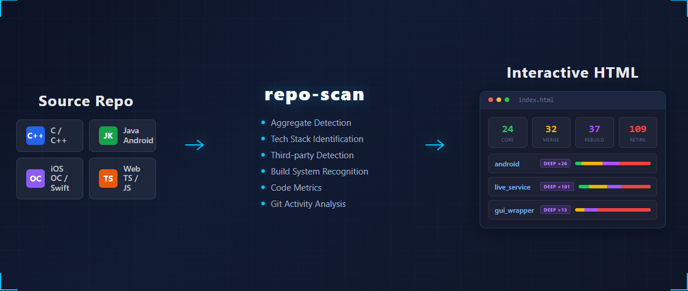
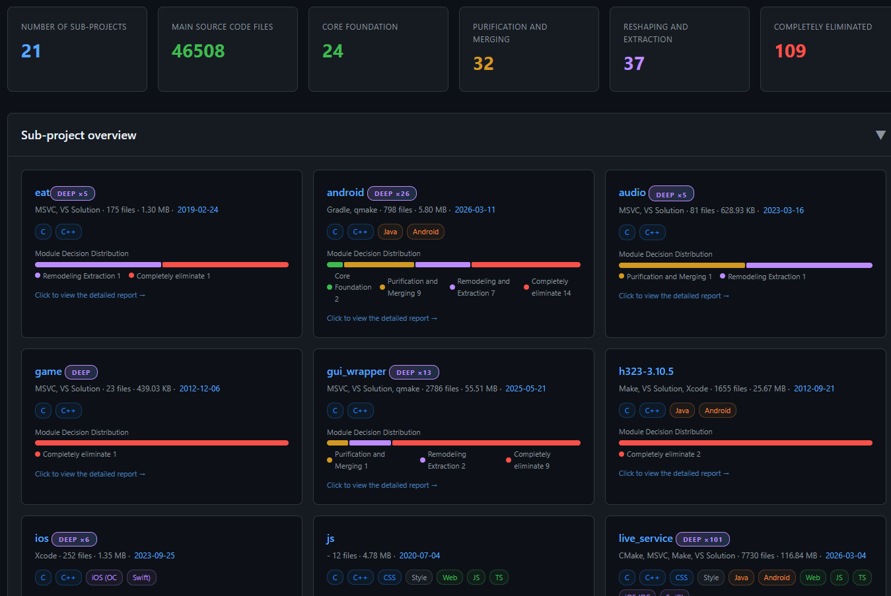
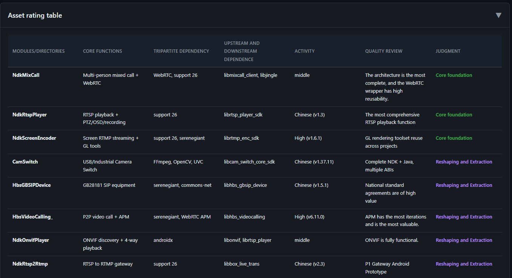
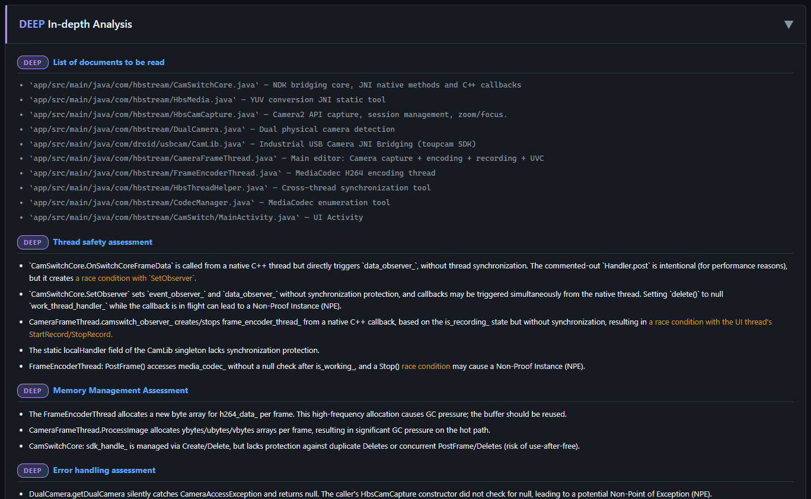

# repo-scan

[](https://www.python.org/)
[](LICENSE)
[]()
[]()

**English** | [中文](README_zh.md)

> Every ecosystem has its own dependency manager, but **no tool looks across C++, Android, iOS, and Web to tell you: how much code is actually yours, what's third-party, and what's dead weight.**
>
> **repo-scan** gives you the answer — a cross-stack source code asset audit that classifies every file, identifies every dependency, and delivers an actionable verdict for each module. One command, zero dependencies, interactive HTML report.



---

## The Problem

You're staring at a monorepo with 200+ directories, 50,000 files, four tech stacks, and third-party code mixed into source folders. Before you can refactor, merge, or make any architectural decision, you need answers:

- Which modules are **core assets** worth investing in?
- Which are **duplicate wheels** that should be merged?
- Which haven't been touched in **3 years** and should be retired?
- Where are the **hidden third-party libs** with no version tracking?

Running `cloc` gives you line counts. Running dependency scanners gives you one stack at a time. **repo-scan gives you the full picture — across all stacks, in one pass.**

## What Sets It Apart

| | Traditional tools | repo-scan |
|---|---|---|
| **Scope** | Single language/ecosystem | C/C++, Java/Android, iOS, Web — unified |
| **Third-party detection** | Declared deps only | Source-embedded libs too (50+ known libraries) |
| **Output** | Raw metrics | Actionable 4-level verdicts per module |
| **Monorepo** | Flat file list | Hierarchical scan with drill-down HTML |
| **AI-native** | N/A | Designed as Agent Skill with token-efficient analysis |

## Core Capabilities

- **Cross-stack unified view** — C/C++, Java/Android, iOS (OC/Swift), Web (TS/JS/Vue) in a single report
- **Three-way file classification** — Project code / third-party / build artifacts with accurate size metrics
- **Third-party detection** — Auto-identifies 50+ libraries (FFmpeg, Boost, OpenSSL...) with version extraction from headers, configs, and package files
- **Four-level verdicts** — Every module gets a decision: **Core Asset** / **Extract & Merge** / **Rebuild** / **Deprecate**
- **Cross-module review** — Second-pass analysis finds capability overlaps, dependency topology, verdict corrections, and refactoring priorities
- **Interactive HTML reports** — Dark-theme local pages; monorepo mode generates `index.html` with clickable project cards and verdict distribution bars
- **Incremental deep analysis** — `deep` mode adds thread safety, memory management, error handling, and API consistency checks on top of standard data
- **Hierarchical scanning** — Large monorepos auto-split into summary + sub-project reports, keeping AI context manageable
- **Code duplication detection** — Finds same-name directories across the project, auto-excludes third-party false positives
- **Git activity analysis** — Discovers all sub-repos with commit history (which modules haven't been touched in 2 years?)
- **AI token efficiency** — Three-layer strategy: filename inference → key file reading → quality sampling (no exhaustive reading)

## Analysis Depth Levels

| Level | Files Read (per module) | Quality Checks | Use Case |
|-------|------------------------|----------------|----------|
| `fast` | 1-2: build config + one key header | Dependency versions only | Quick inventory of huge directories (hundreds of modules) |
| `standard` | 2-5: headers + entry files + build config | Full: deps, architecture, tech debt | Default audit |
| `deep` | 5-10: adds core implementation, tests, CI | Thread safety, memory, error handling, API consistency | Incremental on top of standard data |

**Deep mode is incremental** — it detects existing scan data, auto-selects high-value modules (Core Asset + Extract & Merge), and appends detailed analysis:

```
/repo-scan /path/to/project --level deep                          # auto-select modules
/repo-scan /path/to/project --level deep --modules base,rtmp_sdk  # specific modules
```

## Output Sections

| Section | Content |
|---------|---------|
| **Architecture Tree** | Physical directory structure, semantically compressed, third-party and dead code color-coded |
| **Module Descriptions** | Function, core classes, dependencies, third-party refs (with version assessment), quality, verdict |
| **Asset Triage Table** | Global summary: **Core Asset** / **Extract & Merge** / **Rebuild** / **Deprecate** |
| **Cross-Module Review** | Capability overlap map, dependency topology, verdict corrections, refactoring priorities |
| **Deep Analysis** | Per-file review, thread safety, memory, error handling, API consistency (purple DEEP badge) |



<details>
<summary>More screenshots: triage table & deep analysis</summary>





</details>

## Quick Start

### Installation

```bash
# Global skills directory
git clone https://github.com/haibindev/repo-scan.git ~/.claude/skills/repo-scan

# Or project-level
git clone https://github.com/haibindev/repo-scan.git .claude/skills/repo-scan
```

### As an Agent Skill

```
/repo-scan /path/to/my-project
/repo-scan /path/to/my-project --level fast
/repo-scan /path/to/my-project --level deep
/repo-scan /path/to/my-project --level deep --modules base,encoder
```

### Standalone Pre-scan

The pre-scan script (Python 3, zero deps) generates structured Markdown data for AI analysis:

```bash
python scripts/pre-scan.py /path/to/project                    # stdout
python scripts/pre-scan.py /path/to/project -o report.md       # single file
python scripts/pre-scan.py /path/to/project -d ./scan-output   # hierarchical (recommended)
python scripts/pre-scan.py /path/to/project -c config.json     # custom config
```

<details>
<summary>Pre-scan output sections</summary>

| # | Section | Description |
|---|---------|-------------|
| 1 | Overall Statistics | Three-way split: project / third-party / build artifacts |
| 2 | Top-Level Breakdown | File count, size, build system, classification per directory |
| 3 | Tech Stack Stats | Per-stack source file counts |
| 4 | Third-Party Deps | Detected libraries with name, version, location, size |
| 5 | Code Duplication | Directories appearing 3+ times (potential copy-paste) |
| 6 | Directory Tree | Clean tree with noise filtered and third-party marked |
| 7 | Git Activity | Commit history and activity for all discovered repos |
| 8 | Noise Summary | Build artifact sizes aggregated by type |

</details>

## Project Structure

```
repo-scan/
├── SKILL.md                       # Skill definition (Agent entry point)
├── reference.md                   # Tech stack audit reference tables
├── config/
│   └── ignore-patterns.json       # Configurable ignore/recognition patterns
├── scripts/
│   ├── pre-scan.py                # Pre-scan script (Python 3, zero deps)
│   ├── gen_html.py                # HTML generator (Markdown → interactive pages)
│   └── i18n.py                    # Internationalization (auto-detects zh/en)
└── templates/
    ├── report.html                # Single project template (dark theme)
    ├── index.html                 # Multi-project summary template (cards + cross-analysis)
    └── dual-scan.html             # Dual-scan cross-validation template
```

## Configuration

Edit `config/ignore-patterns.json` to customize patterns:

```jsonc
{
  "noise_dirs": {
    "common": [".git", ".svn", "obj", "tmp"],
    "cpp": ["Debug", "Release", "x64", "ipch"],
    "java_android": [".gradle", "build", "target"],
    "ios": ["DerivedData", "Pods", "xcuserdata"],
    "web": ["node_modules", "dist", ".next"]
  },
  "thirdparty_dirs": {
    "container_names": ["vendor", "external", "libs"],
    "known_libs": ["ffmpeg", "boost", "openssl", ...]
  }
}
```

## Requirements

- Python 3.6+
- An AI Agent with custom skill support (e.g. [Claude Code](https://docs.anthropic.com/en/docs/claude-code))
- Git (optional, for activity analysis)

## Star History

[](https://star-history.com/#haibindev/repo-scan&Date)

## License

[MIT](LICENSE)
