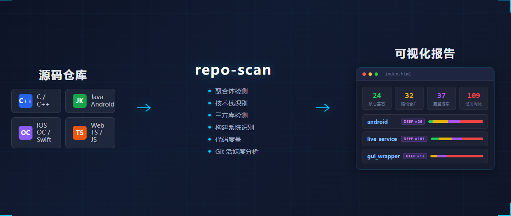
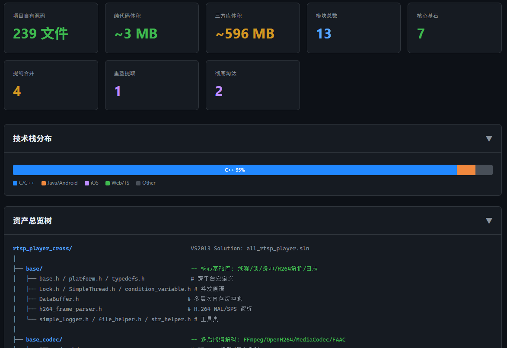
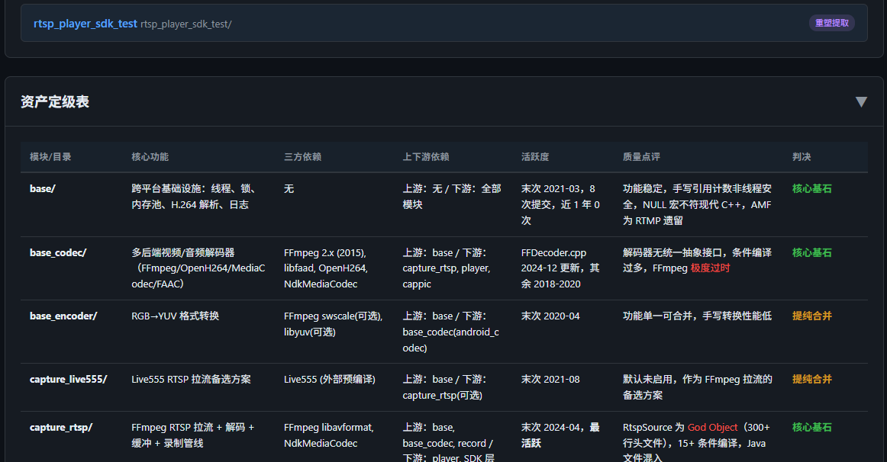
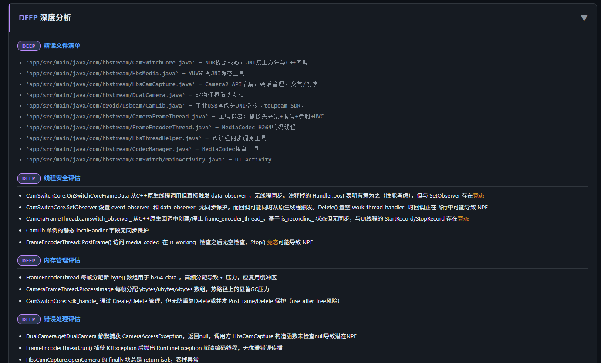

# repo-scan

[](https://www.python.org/)
[](LICENSE)
[]()
[]()

[English](README.md) | **中文**

> 每个生态都有自己的依赖管理，但**没有工具能横跨 C++、Android、iOS、Web 四大技术栈告诉你：哪些是你自己的代码，哪些是三方库，哪些是该淘汰的死代码。**
>
> **repo-scan** 给你答案 — 一次跨技术栈的源码资产审计，对每个文件分类、每个依赖识别、每个模块给出可执行的判决。一行命令，零依赖，交互式 HTML 报告。



---

## 痛点

你面前是一个 200+ 目录、50000 文件、四种技术栈的 monorepo，三方代码混在源码目录里。在重构、合并或做任何架构决策之前，你需要答案：

- 哪些模块是**核心资产**，值得持续投入？
- 哪些是**重复造轮子**，应该合并？
- 哪些**三年没人动过**，该淘汰了？
- 哪些**三方库藏在源码里**，没有版本追踪？

跑 `cloc` 只能给你行数。跑依赖扫描一次只管一个栈。**repo-scan 一次扫描给你全局视图 — 横跨所有技术栈。**

## 凭什么不一样

| | 传统工具 | repo-scan |
|---|---|---|
| **覆盖范围** | 单语言/单生态 | C/C++、Java/Android、iOS、Web 统一视图 |
| **三方库检测** | 仅声明式依赖 | 源码内嵌库也能识别（50+ 已知库） |
| **输出** | 原始指标 | 每个模块可执行的四级判决 |
| **Monorepo** | 扁平文件列表 | 分级扫描 + 可下钻的 HTML 报告 |
| **AI 原生** | 无 | 专为 Agent Skill 设计，Token 高效分析 |

## 核心能力

- **跨技术栈统一视图** — C/C++、Java/Android、iOS (OC/Swift)、Web (TS/JS/Vue) 一份报告全覆盖
- **三分类扫描** — 项目代码 / 三方依赖 / 构建产物，精确统计体积占比
- **三方库智能识别** — 自动识别 50+ 已知库（FFmpeg、Boost、OpenSSL...），从头文件、构建配置、package 文件提取版本号
- **四级判决** — 每个模块一个定论：**核心基石** / **提纯合并** / **重塑提取** / **彻底淘汰**
- **全局交叉审阅** — 二次阅读识别能力重叠、依赖拓扑、修正判决、重构优先级
- **可视化 HTML 报告** — 深色主题本地交互页面；分级模式生成 `index.html` + 子项目卡片，点击跳转详情
- **增量式深度分析** — `deep` 模式在 standard 基础上追加线程安全、内存管理、错误处理、API 一致性检查
- **分级扫描** — 大型 monorepo 自动拆分为汇总 + 子项目报告，不超出 AI 上下文
- **代码重复检测** — 发现跨目录同名模块（疑似 copy-paste），自动排除三方库误报
- **Git 活跃度分析** — 自动发现所有子仓库，统计提交历史（哪些模块两年没人动了？）
- **AI Token 节约** — "文件名推断 → 关键文件精读 → 质量抽样"三层策略，不做穷举式阅读

## 分析深度级别

| 级别 | 精读文件数（每模块） | 质量检查 | 适用场景 |
|------|---------------------|---------|---------|
| `fast` | 1-2 个：构建配置 + 最核心头文件 | 仅推断依赖版本 | 超大目录快速摸底（数百模块） |
| `standard` | 2-5 个：头文件 + 入口 + 构建配置 | 完整：依赖、架构、技术债 | 常规审计（默认） |
| `deep` | 5-10 个：增加核心实现、测试、CI | 线程安全、内存、错误处理、API 一致性 | 在 standard 基础上增量深钻 |
| `full` | 模块内全部文件 | 完整分析 + 横向对比 | 整合前全面摸底 |

**deep 模式是增量式的** — 自动检测已有扫描数据，按判决筛选高价值模块（核心基石 + 提纯合并），追加深度分析：

```
/repo-scan /path/to/project --level deep                          # 自动筛选模块
/repo-scan /path/to/project --level deep --modules base,rtmp_sdk  # 指定模块
```

**`--gap-check` — 增量能力差异检测** — 扫描完成后，对比 hbcore 模块与候选源码目录，找出遗漏的符号、API 差异和实现改进点：

```bash
py -3 scripts/capability_gap.py --hbcore /path/to/hbcore --config gap-config.json
py -3 scripts/capability_gap.py --hbcore /path/to/hbcore --config gap-config.json -m base
```

将 `config/gap-config-example.json` 复制为 `gap-config.json`，填入本机路径后运行。输出带 `[MANDATORY-IMPORT]`、`[MANDATORY-EVAL]`、`[EVAL-IMPL]` 标签的 Markdown 报告。

## 输出格式

| 段落 | 内容 |
|------|------|
| **资产总览树** | 真实物理目录结构，语义压缩，三方库和废弃代码已着色标记 |
| **模块级描述** | 功能、核心类名、依赖关系、三方库引用（含版本评估）、代码质量、四级判决 |
| **资产定级表** | 全局汇总：**核心基石** / **提纯合并** / **重塑提取** / **彻底淘汰** |
| **跨模块交叉审阅** | 能力重叠地图、依赖拓扑、修正判决、重构优先级 |
| **Deep 深度分析** | 逐文件精读、线程安全、内存管理、错误处理、API 一致性（紫色 DEEP 徽章） |



<details>
<summary>更多截图：定级表 & 深度分析</summary>





</details>

## 快速开始

### 安装

```bash
# 全局技能目录
git clone https://github.com/haibindev/repo-scan.git ~/.claude/skills/repo-scan

# 或项目级
git clone https://github.com/haibindev/repo-scan.git .claude/skills/repo-scan
```

### 作为 Agent 技能

```
/repo-scan /path/to/my-project
/repo-scan /path/to/my-project --level fast
/repo-scan /path/to/my-project --level deep
/repo-scan /path/to/my-project --level deep --modules base,encoder
```

### 单独运行预扫描

预扫描脚本（Python 3，零依赖）生成结构化 Markdown 数据供 AI 分析：

```bash
python scripts/pre-scan.py /path/to/project                    # 输出到终端
python scripts/pre-scan.py /path/to/project -o report.md       # 单文件报告
python scripts/pre-scan.py /path/to/project -d ./scan-output   # 分级目录报告（推荐）
python scripts/pre-scan.py /path/to/project -c config.json     # 自定义配置
```

<details>
<summary>预扫描输出章节</summary>

| # | 章节 | 说明 |
|---|------|------|
| 1 | 总体统计 | 项目代码 / 三方库 / 构建产物 三分类统计 |
| 2 | 顶级目录分解 | 每个顶级目录的文件数、体积、构建系统、分类标记 |
| 3 | 技术栈统计 | 按技术栈分类统计源码文件 |
| 4 | 三方依赖清单 | 已识别的三方库（库名、版本、位置、体积） |
| 5 | 代码重复检测 | 同名目录出现 3+ 次的疑似代码重复 |
| 6 | 目录树 | 过滤噪声、标记三方库的清洁目录树 |
| 7 | Git 活跃度 | 所有子仓库的提交历史和活跃度 |
| 8 | 噪声汇总 | 构建产物按类型聚合统计 |

</details>

## 项目结构

```
repo-scan/
├── SKILL.md                       # 技能主文件（Agent 加载入口）
├── deep-mode.md                   # deep 模式与 --modules 匹配规则
├── full-mode.md                   # full 模式规则
├── reference.md                   # 各技术栈审计维度速查表
├── config/
│   ├── ignore-patterns.json       # 可配置的忽略/识别模式
│   └── gap-config-example.json    # --gap-check 示例配置（复制后填入本机路径）
├── scripts/
│   ├── pre-scan.py                # 预扫描脚本（Python 3，零依赖）
│   ├── capability_gap.py          # 增量能力差异检测（--gap-check）
│   ├── gen_html.py                # HTML 生成（Markdown → 可视化页面）
│   └── i18n.py                    # 国际化（自动检测中英文）
└── templates/
    ├── report.html                # 单项目报告模板（深色主题）
    ├── index.html                 # 多项目汇总模板（卡片 + 交叉分析）
    └── dual-scan.html             # 双扫描交叉验证模板
```

## 自定义配置

编辑 `config/ignore-patterns.json` 自定义忽略和识别模式：

```jsonc
{
  "noise_dirs": {
    "common": [".git", ".svn", "obj", "tmp"],
    "cpp": ["Debug", "Release", "x64", "ipch"],
    "java_android": [".gradle", "build", "target"],
    "ios": ["DerivedData", "Pods", "xcuserdata"],
    "web": ["node_modules", "dist", ".next"]
  },
  "thirdparty_dirs": {
    "container_names": ["vendor", "external", "libs"],
    "known_libs": ["ffmpeg", "boost", "openssl", ...]
  }
}
```

## 系统要求

- Python 3.6+
- 支持自定义技能的 AI Agent（如 [Claude Code](https://docs.anthropic.com/en/docs/claude-code)）
- Git（可选，用于活跃度分析）

## 星标历史

[](https://star-history.com/#haibindev/repo-scan&Date)

## 许可证

[MIT](LICENSE)
